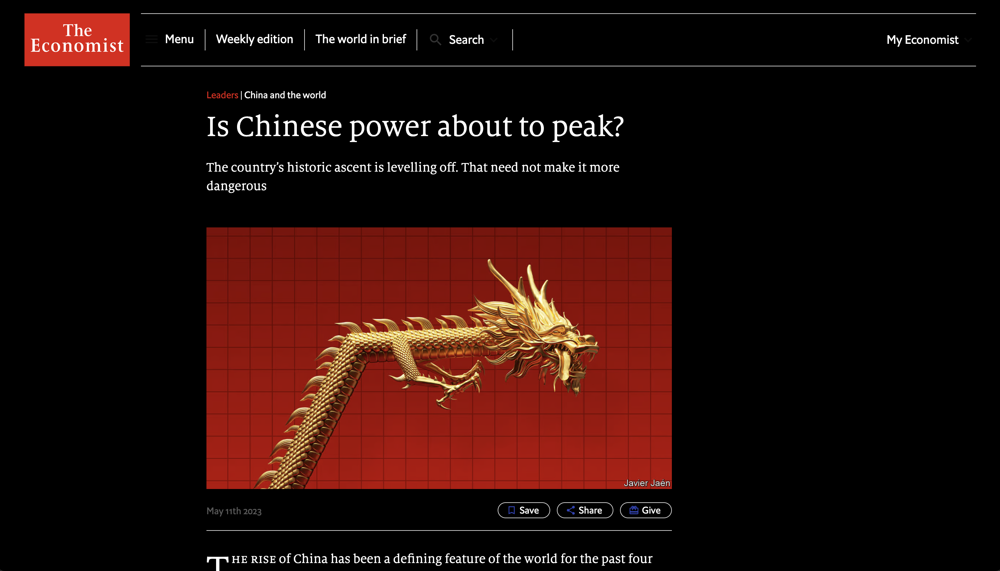

# dark

Chrome extension to read economist.com in dark mode.

**Warning** this is NOT an officially supported extension.
It uses injected stylesheets and a script to override some CSS variables.
Some parts may be broken. Use at your own risk!

Pull requests to improve it are welcome.

## How to install

1. Clone this repo.
2. Go to `chrome://extensions` and turn on developer mode.
3. Click "Load unpacked" and point the destination at the directory that contains this repo.

That's it.

For more information see https://developer.chrome.com/docs/extensions/mv3/getstarted/development-basics/