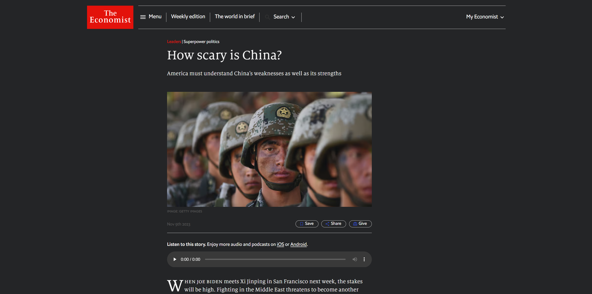

# dark

Chrome extension to read economist.com in dark mode.

Update: warning, this will break the Insider section of the website. Use at your own risk.

## Disclaimer

This extension is NOT officially supported by _The Economist_.
It might break some parts of the website.

## How it works

This extension uses injected stylesheets to override CSS rules and a script to change some CSS variables.
That's it.

## How to install

1. Clone this repo.
2. Go to `chrome://extensions` and turn on developer mode.
3. Click "Load unpacked" and point the destination at the directory that contains this repo.

## How to update
1. Pull the latest changes from this repo.
2. Go to `chrome://extensions` and reload this extension.

## Contributing

Pull requests to improve this extension are welcome.